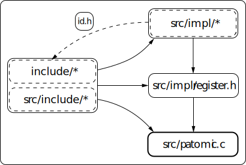

# Architecture
The purpose of this document is to provide a high level overview of this project.
It will highlight the key components, and show how they fit together.



## Overview
At its most basic, this project is a collection of self-contained implementations
which expose a uniform interface. Each implementation has its own directory inside
`/src/impls/` and exposes the following two functions in its header file:
```c
patomic_t
patomic_impl_create(
    size_t byte_width,
    patomic_memory_order_t memory_order,
    int options
);

patomic_explicit_t
patomic_impl_create_explicit(
    size_t byte_width,
    int options
);
```
The names of these functions should contain some unique identifier (e.g. the
implementation name) since each implementation exposes these functions, and the
names must not clash between implementations. All other functions defined by an
implementation must be marked `static` to avoid collisions.

Inside `/src/impl/register.h` the following array exists:
```c
typedef struct {
    patomic_impl_id_t id;
    patomic_t (* fp_create) (size_t, patomic_memory_order_t, int);
    patomic_explicit_t (* fp_create_explicit) (size_t, int);
} patomic_impl_t;

static const patomic_impl_t
patomic_impl_register[] = {
    /* implementations */
};
```
Each implementation gives itself an entry in the `patomic_impl_id_t` enum in
`/include/patomic/types/ids.h`. Using that enum and the two functions it exposes
in its header file, each implementation then gives itself an entry in the 
`patomic_impl_register` array in `/src/impl/register.h`.

Inside `/src/patomic.c` this array is traversed and implementations are combined
before being presented to the user through functions declared in 
`/include/patomic/patomic.h`.

## File Structure
### `/include/patomic/*`
All files in this directory are header files, they form the public API. These 
files can be included both by the user of this library and by internal library 
files. Functions in these files are all marked as `static` (since they may be
included by the user in multiple translation units) and are stateless.
The only exception to this is functions declared in `/include/patomic/patomic.h`
which are defined in `/src/patomic.c`; such functions may have state and are not
marked as`static`.

### `/src/include/patomic/*`
All files in this directory are header files, and they represent private parts of
the API. These files can only be included by files in `/src/` so as not to leak
there way into the public API.

### `/src/impl/*`
This directory contains `register.h` and a separate directory per unique
implementation. Each implementation may put whatever it wants within its directory,
provided it marks all its functions as `static` (except functions mentioned in 
the previous section).

## Information Flow
The user provides the API with the following information:
* `size_t byte_width`
* `patomic_memory_order_t memory_order` (if calling the non-explicit version)
* `int options`
* `int impl_id_argc`
* `patomic_impl_id_t ...`

The API function (defined in `/src/patomic.c`) may use, ignore, or otherwise treat
any implementation ids passed based on which bits are set in the `options` value.
The function may modify the `options` value before moving onto the next step.
This should not be an issue since there are no `options` values which affect the
correctness of the user's program.

The API function will then pass the following information to all implementations
it has decided to use:
* `size_t byte_width`
* `patomic_memory_order_t memory_order` (if calling the non-explicit version)
* `int options` (this may have been modified inside the API function)

The implementation will then use this information to produce a `patomic_t` or
`patomic_explicit_t` object, which is guaranteed to be valid for the given
`byte_width` and `memory_order` values. A best faith effort will be made to abide
by any `options` set, however these may be ignored (and it will not affect the
correctness of any program).

The API function will combine the objects from the implementations in an unspecified
manner (which does not affect the correctness of the program), and return the 
final object to the user.